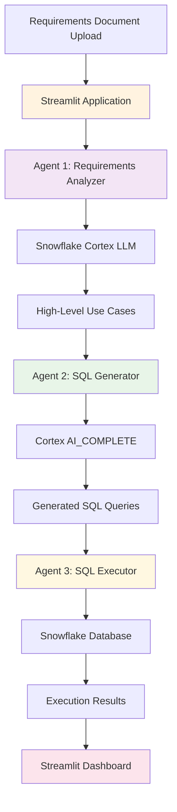

# ❄️  SQL Test Case Generation Agent System

A sophisticated multi-agent system that automatically processes software requirements documents and generates executable SQL test cases for Snowflake databases, specifically designed for the Property & Casualty (P&C) Insurance domain.

## 🚀 Overview

This application leverages a three-agent architecture to transform natural language requirements into comprehensive database test scenarios:

1. **Agent 1 (Requirements Analyzer)** – Analyzes requirements documents using Snowflake Cortex LLM  
2. **Agent 2 (SQL Generator)** – Converts use cases into executable SQL queries using **Snowflake Cortex `AI_Complete()` function**  
3. **Agent 3 (SQL Executor)** – Executes queries against Snowflake and formats results

## 🏗️ System Architecture



Add comment

## 🎯 Key Features

- **Automated Test Case Generation**: Transforms requirements into actionable database tests  
- **Multi-Agent Architecture**: Specialized agents for different stages of the pipeline  
- **P&C Insurance Domain**: Pre-configured with insurance industry database schema  
- **Real-time Processing**: Interactive Streamlit interface with live results  
- **Comprehensive Coverage**: Generates both simple and complex SQL test scenarios  
- **Error Handling**: Robust error management and user feedback  

## 📋 Prerequisites

- Python 3.8+  
- Snowflake account with appropriate permissions  
- Required Python packages (see requirements.txt)

## 🛠️ Installation

### Step 1: Clone the Repository
```bash
git clone <repository-url>
cd -Multi_Agent_Application
```

### Step 2: Install Dependencies
```bash
pip install -r requirements.txt
```

### Step 3: Configure Connections
Edit `configuration.py` to add your credentials:

```python
class ConfigurationExecutor:    
    def get_connection_params(self):
        return {
            "user": "your_snowflake_user",
            "account": "your_snowflake_account",
            "password": "your_password",
            "role": "sysadmin",
            "warehouse": "your_warehouse",
            "database": "your_database",
            "schema": "your_schema"
        }
```

### Step 4: Run the Application
```bash
streamlit run app.py
```

## 📖 Step-by-Step Usage Guide

<details>
<summary>Expand to view full guide</summary>

### Step 1: Prepare Your Requirements Document
- Create a `.txt` file containing your software requirements
- Focus on database-related functionalities, data entities, and business rules
- Ensure requirements are clear and specific to get better test cases

### Step 2: Upload Requirements
1. Open the Streamlit application in your browser
2. Navigate to the "Upload Requirements Document" section
3. Click "Choose a .txt file" and select your requirements document
4. Review the document preview to ensure it loaded correctly

### Step 3: Process Requirements
1. Click the "Process Requirements and Generate SQL Tests" button
2. Wait for the agents to complete their work (this may take 1-2 minutes)
3. Monitor the progress spinner and any status messages

### Step 4: Review Generated Use Cases
- **Agent 1 Output**: Review the high-level use cases extracted from your requirements
- These should represent key database testing scenarios
- Typically 1-2 use cases are generated for focused testing

### Step 5: Examine SQL Queries
- **Agent 2 Output**: Review the generated SQL queries
- Each query corresponds to a specific use case
- Queries are tailored to the P&C Insurance database schema

### Step 6: Analyze Execution Results
- **Agent 3 Output**: Review query execution results
- Results are limited to 10 rows per query for readability
- Check for any execution errors or unexpected results

</details>

## 🗄️ Database Schema

The system uses a comprehensive P&C Insurance database schema including:

### Core Tables
- **Users**: System users and roles
- **Customers**: Individual and corporate clients
- **Policies**: Insurance policies and coverage details
- **PolicyCoverages**: Specific coverage types and limits

### Claims Management
- **Claims**: Claim records and status
- **Claimants**: Parties involved in claims
- **ClaimCoverages**: Coverage-specific claim details
- **ClaimReserves**: Financial reserves for claims
- **ClaimPayments**: Payment records
- **ClaimSubrogations**: Recovery records

### Financial & Billing
- **BillingSchedules**: Payment schedules
- **PolicyTransactions**: Policy changes and adjustments
- **InsuredAssets**: Assets covered by policies

## 🔧 Agent Details

### Agent 1: Requirements Analyzer
- **Purpose**: Extracts testable scenarios from requirements  
- **Technology**: Snowflake Cortex LLM (Mistral-Large2)  
- **Output**: JSON array of high-level use cases  
- **Limit**: Generates 1-2 focused use cases per run  

### Agent 2: SQL Generator
- **Purpose**: Converts use cases to executable SQL  
- **Technology**: **Snowflake Cortex `AI_Complete()` function**  
- **Input**: High-level use cases + P&C schema  
- **Output**: Snowflake-compatible SQL queries  

### Agent 3: SQL Executor
- **Purpose**: Executes queries and formats results  
- **Technology**: Snowflake Snowpark  
- **Features**: Error handling, result limiting, tabular formatting  
- **Output**: Structured query results  

## 📊 Sample Output

### Example Use Cases
```json
[
  "Verify the accuracy of total premium calculation across all policy coverages for active policies",
  "Ensure data consistency between claims and policy coverage relationships for proper claim processing"
]
```

### Example Generated SQL
```sql
SELECT 
    p.PolicyID,
    p.TotalPremium,
    SUM(pc.PremiumForCoverage) as CalculatedPremium
FROM Policies p
JOIN PolicyCoverages pc ON p.PolicyID = pc.PolicyID
WHERE p.Status = 'Active'
GROUP BY p.PolicyID, p.TotalPremium
HAVING p.TotalPremium != SUM(pc.PremiumForCoverage);
```

## ⚠️ Important Notes

### Security
- Use environment variables or secure configuration management  
- Ensure proper Snowflake role-based access controls  

### Performance
- Query results are limited to 10 rows for UI performance  
- Large requirements documents may take longer to process  
- Consider breaking down complex requirements into smaller chunks  

### Limitations
- Currently optimized for P&C Insurance domain  
- Requires valid Snowflake API credentials  
- SQL execution depends on actual database connectivity  

## 🛡️ Error Handling

The system includes comprehensive error handling:
- **Connection Errors**: Clear messages for database connectivity issues  
- **API Errors**: Graceful handling of LLM API failures  
- **SQL Errors**: Detailed SQL execution error reporting  
- **Input Validation**: Requirements document format validation  

## 🔄 Extending the System

### Adding New Domains
1. Update the schema in `agent2_sql_generator.py`
2. Modify the semantic model YAML structure
3. Adjust use case generation prompts in Agent 1

### Custom Agents
1. Create new agent classes following the existing pattern
2. Update `app.py` to include new agents
3. Modify the Streamlit UI to display new agent outputs

## 📞 Support

For issues, questions, or contributions:
1. Check the error messages in the Streamlit interface
2. Review the console logs for detailed debugging information
3. Ensure all credentials are properly configured
4. Verify network connectivity to Snowflake APIs

## 📄 License

Multi-Agent System for P&C Insurance Test Case Generation

---
